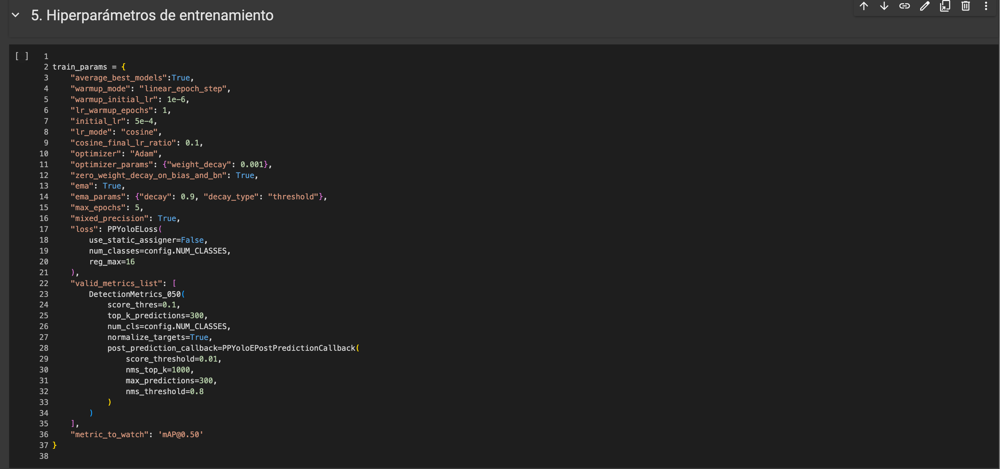
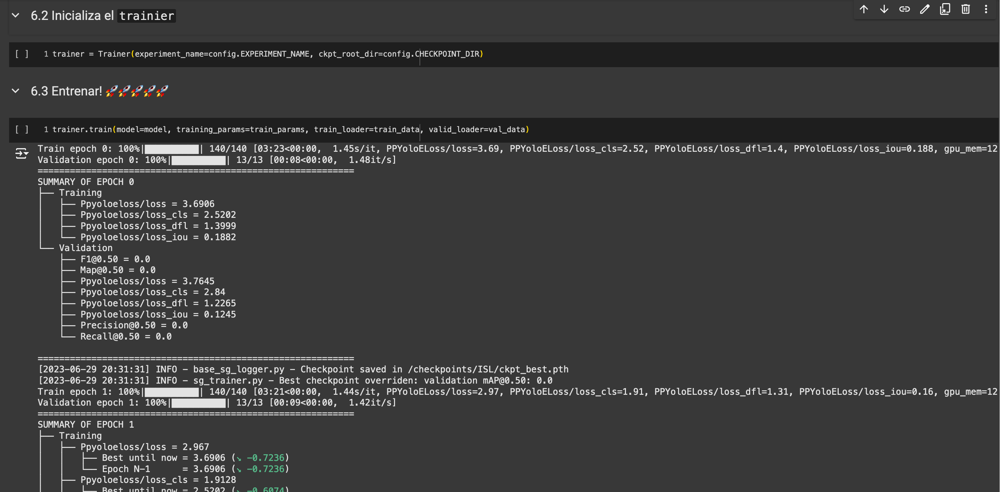
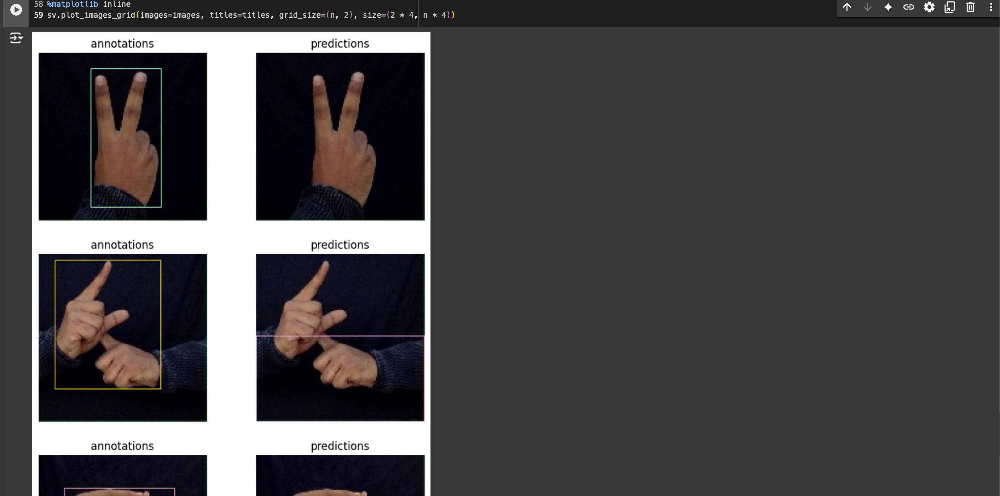

# Detección de Lenguaje de Señas con YOLO NAS 🔍

Este proyecto muestra cómo realizar detección de lenguaje de señas utilizando **YOLO NAS** para identificar diferentes clases de señas en imágenes. Fue realizado como parte de mi portafolio para un proyecto universitario dentro del campo de la Inteligencia Artificial.

## Objetivos del Proyecto 🛠️
1. Preparar un entorno de desarrollo para entrenamiento de modelos de detección de lenguaje señas.
2. Descargar y configurar un dataset compatible con YOLO.
3. Entrenar el modelo utilizando **YOLO NAS** para detectar múltiples clases de objetos.
4. Evaluar el rendimiento del modelo con métricas como **mAP** y **F1-Score**.
5. Documentar los resultados y proponer mejoras en el modelo.

---

## Herramientas Utilizadas 🔧
- **YOLO NAS**: Para la detección de objetos.
- **Roboflow**: Plataforma para obtener datasets etiquetados.
- **Google Colab**: Para facilitar el entrenamiento en la nube.
- **GitHub**: Para documentar y compartir el proyecto.

---

## Pasos Realizados 📝

1. **Configuración del Entorno de Desarrollo**  
   - Instalé las dependencias necesarias en un entorno virtual de Google Colab.  
   - Configuré el entorno de trabajo para usar el modelo **YOLO NAS** y descargar el dataset desde Roboflow.

2. **Obtención y Preparación del Dataset**  
   - Usé **Roboflow** para obtener un dataset con múltiples clases de objetos en formato compatible con **YOLO**.  
   - Descargué el dataset y lo preparé para entrenamiento, organizando las imágenes y etiquetas.

3. **Entrenamiento del Modelo**  
   - Utilicé el modelo **YOLO NAS** para entrenar sobre el dataset obtenido.  
   - Ajusté hiperparámetros como tasa de aprendizaje y número de épocas para optimizar el rendimiento.

4. **Evaluación del Modelo**  
   - Evalué el rendimiento del modelo utilizando métricas como **mAP** y **F1-Score** en el conjunto de datos de validación.  
   - Analicé los resultados y realicé ajustes según fuera necesario.

5. **Documentación y Resultados**  
   - Exporté los resultados del entrenamiento y capturé imágenes del proceso.  
   - Documenté los hallazgos y sugerí pasos a seguir para mejorar el modelo.

---

## Resultados Principales 📊

| Métrica       | Valor   |
|----------------|---------|
| **mAP@0.50**  | 0.7030   |
| **F1-Score**  | 0.0981   |
| **Precisión** | 0.0524   |
| **Recall**    | 0.9937   |

- **Hallazgo Destacado**:  
  - Modelo: **YOLO NAS**.  
  - Impacto: Detecta múltiples clases de objetos con un **mAP@0.50** de 0.7030.  
  - Solución Propuesta: Ajustar la tasa de aprendizaje y aumentar el número de épocas para mejorar la precisión.

---

## Capturas de Pantalla 📷

| Configuración del Modelo | Progreso del Entrenamiento | Resultados de Evaluación |
|--------------------------|----------------------------|--------------------------|
|  |  |  |

---

## Reporte 📑
 
- [Reporte de Evaluación Final](results/evaluation-report.pdf)

---

## Próximos Pasos 🚀

1. Entrenar el modelo con un dataset más grande para mejorar la precisión.
2. Implementar técnicas de *data augmentation* para mejorar la generalización del modelo.
3. Integrar el modelo en un sistema de análisis forense digital para la detección de objetos en imágenes de evidencia.

---

## Autor 👨‍💻

**[Jorge Balarezo Cardenas]**  
- LinkedIn: [Enlace a tu perfil](https://www.linkedin.com/in/jorge-balarezo-cardenas/)  
- Email: [jbalarezocarden@gmail.com]

---

## Licencia 📜
Este proyecto está bajo la Licencia MIT. Para más detalles, revisa el archivo [LICENSE](LICENSE).
